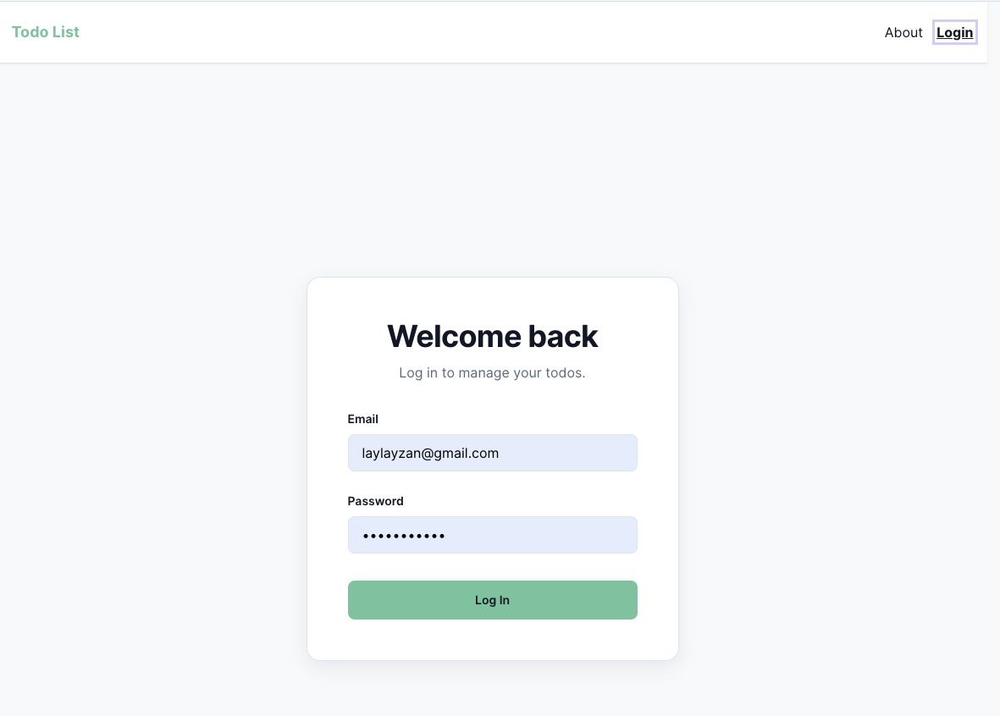
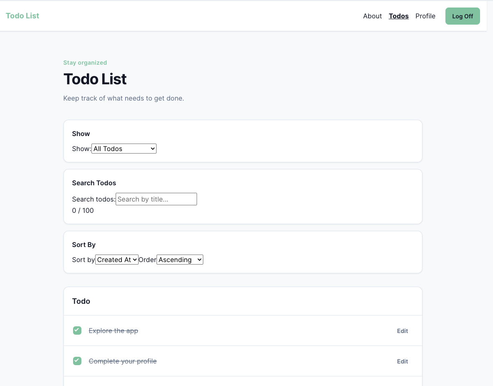
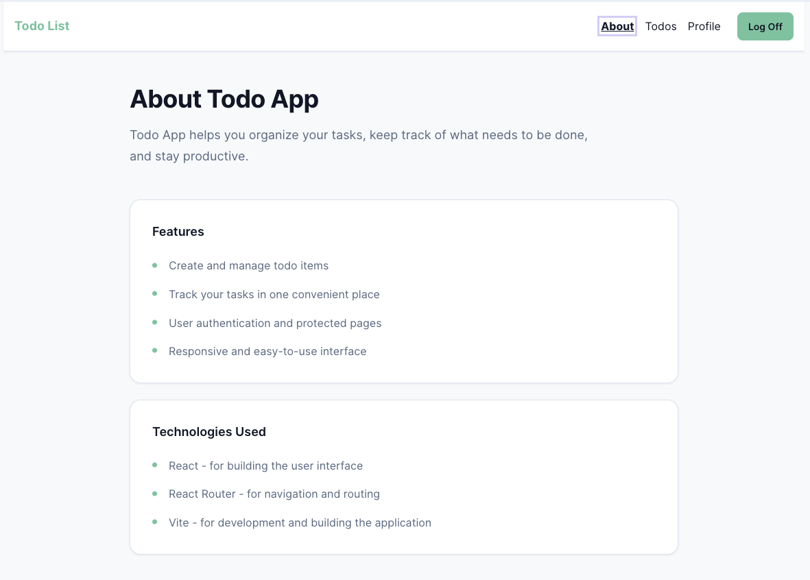
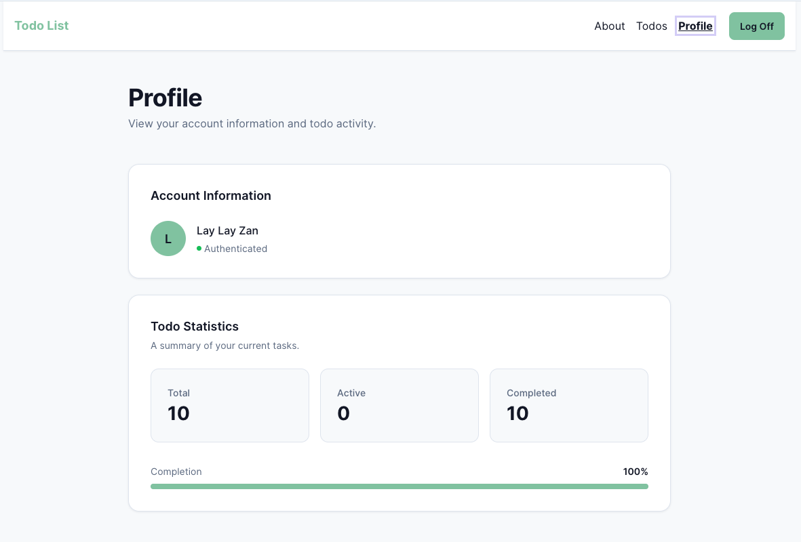
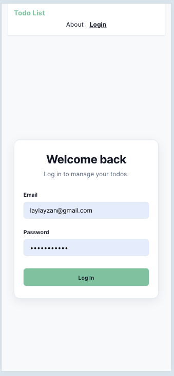
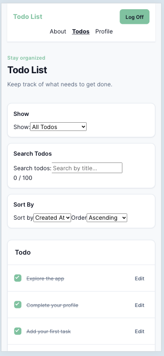
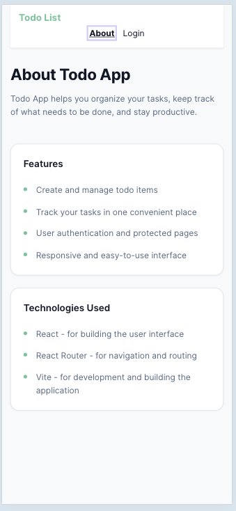
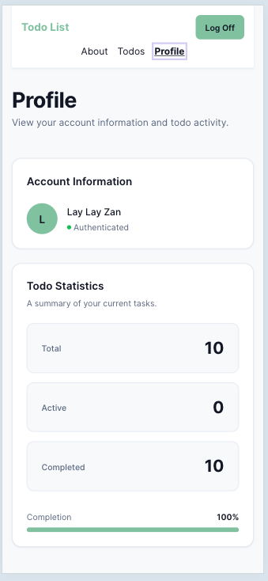

# Basics Summary About the Project

The app's name is Vite and uses a React Template. 
The project displays a simple to-do list.
To install Vite type "npm install" into your terminal.
To run the project enter the following command: "npm run dev". The result will give you a link to view the project.

# PROJECT TITLE AND DESCRIPTION
    ## LAY LAY'S CTD TODO APP PROJECT
    ## Note: This project is currently not deployed.

# NOT DEPLOYING

    Not currently deployed. The application can be run locally using the instructions below.

# FEATURES LIST

    - user registration and authentication
    - protected pages for authenticated users
    - create todo items
    - mark todo items as completed
    - view active and completed todos
    - search todos by title
    - sort todos by available sorting options
    - filter todos by status
    - optimistic UI updates for todo actions
    - error handling for failed API requests
    - responsive interface for desktop and mobile devices
    - client-side validation for todo titles
    - profile page with todo statistics
    - completion percentage calculation
    - consistent application-wide design using CSS variables

# TECHNOLOGIES USED

    - React = used to building the user interface
    - React Router = used for client-side routing and protected routes
    - Vite = used for development server and production build tool
    - JavaScript = used for application logic
    - CSS Modules = used for component and page specific styling
    - CSS Custom Properties = used Global design tokens for consistent styling

# SCREENSHOTS

    ## Desktop
        ### Login Page: 

        

        ### TodoList Page:
        

        ### About Page:
        

        ### Profile Page: 
        

    ## Mobile

        ### Login Page:
        

        ### TodoList Page:
        

        ### About Page:
        

        ### Profile Page: 
        

# GETTING STARTED SECTION

    ## Before running the application locally, users should have the following installed:
        - Node.js
        - npm
        - Git
    ## Installation:
        - clone the repository --> git clone GIT_REPO_URL
        - navigate into the project directory --> cd todo-list
        - install the project --> npm install

# AVAILABLE SCRIPTS

    ## The following npm scripts are available through package.json
        - npm run dev = starts the Vite development server
        - npm run build = creates optimized production build
        - npm run preview = runs the production build locally so it can be tested before deployment

# STYLE DOCUMENTATION / DESIGN DECISIONS

    ## The application design uses consistent design system built around reusable CSS variables and CSS modules.
        - Global colors, spacing, typography, borders, and transitions are defined in variables.css
        - This approach allows the application to maintain consistent styling across different pages and components.
        - Page component style uses CSS modules rather than one large stylesheet. This keeps styles scoped to their components and reduces the possibility of unintended CSS conflicts.
    ## Visual Style: the application uses a modern and minimal look to keep the design organized and clean.
        - a light and clean background
        - white surface cards
        - Green as a primary color inspired by the green check Apple emoji
        - muted secondary text to create text hierarchy
        - subtle borders, soft shadows and rounded corners to create a less harsh look.
    ## The goal was to create a simple interface that keeps focus on managing tasks.

# FUTURE IMPROVEMENTS

    ## If I had additional development time, I would include the following:
        - todo deletion option
        - todo due dates or a calendar
        - todo categories
        - dark mode
        - profile editing option to customize their profile
        - a more whimsical and playful design
    

# LICENSE INFORMATION

    This project is licensed under the MIT License. See the [LICENSE](./LICENSE) file for details.

# CONTACT INFORMATION

    ## GitHub Profile: https://github.com/llzan
    ## GitHub Repository: https://github.com/llzan?tab=repositories

